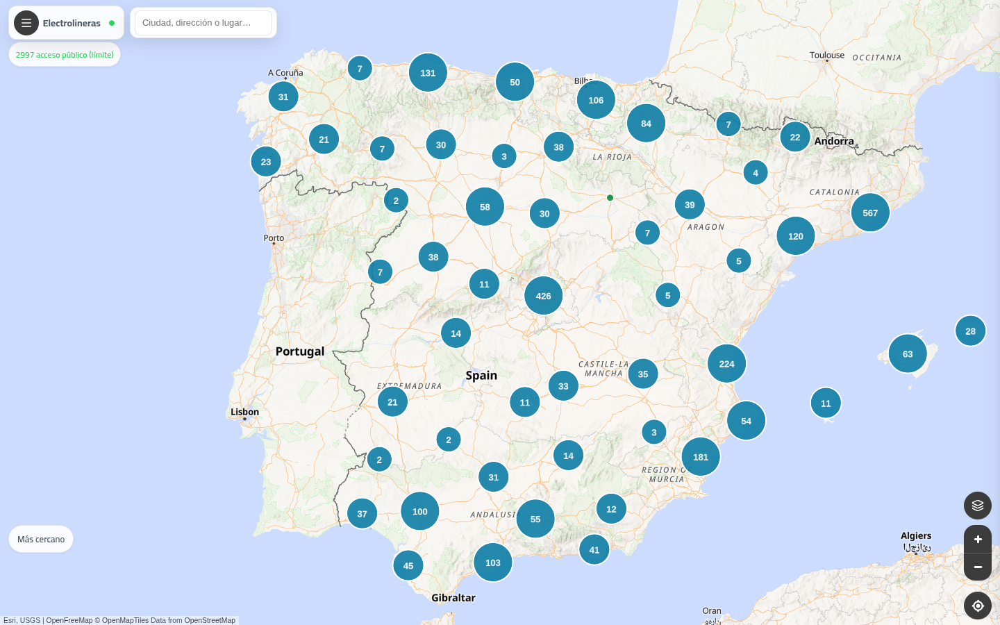
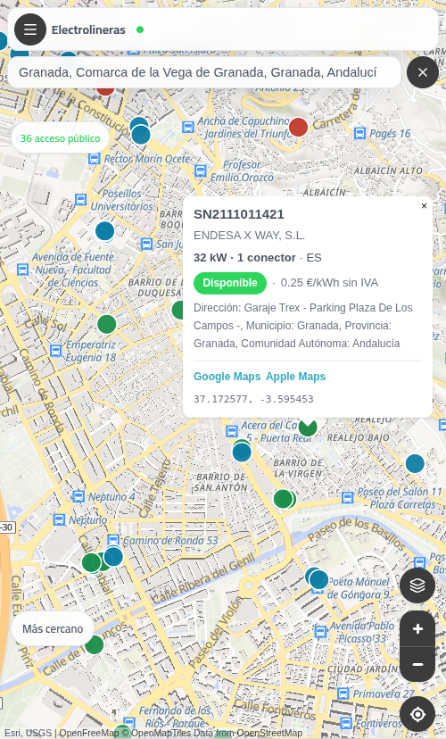
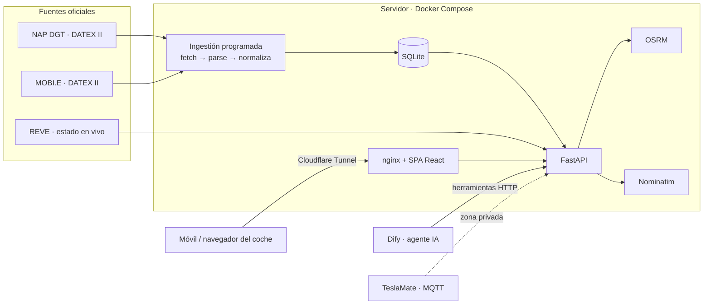

# Electrolineras ⚡ — cargadores de VE en España y Portugal

[](https://github.com/jualas/electrolineras/actions/workflows/ci.yml)


**Demo en producción: <https://electro.jualas.es>**

Mapa unificado de los **~22 000 puntos de recarga** de España y Portugal a partir de los datos abiertos oficiales (DATEX II), con estado en tiempo real, búsqueda de cargadores **en el corredor de una ruta** y planificador de paradas de carga. Pensado para usarse desde el móvil y desde el navegador del coche (Tesla).

| Escritorio | Móvil |
|---|---|
|  |  |

## Problema que resuelve

La información de recarga está dispersa y el **navegador del coche** suele proponer paradas malas: desvíos largos a cargadores «de paso» o paradas que obligan a salir de la autovía, cambiar de sentido y volver a incorporarse.

**Caso típico:** desde Granada con 44 % de batería hacia Cartagena, encontrar en segundos cargadores **≥ 100 kW en la carretera**, en sentido de marcha y con el menor desvío posible. Detalle: [`docs/ROUTE_CORRIDOR_SEARCH.md`](docs/ROUTE_CORRIDOR_SEARCH.md).

## Qué hace

**Zona pública**
- Mapa de España y Portugal con clústeres, filtros por **potencia**, operador y acceso público.
- Búsqueda por ciudad o dirección (geocodificación con Nominatim *self-hosted*) y botón **«Más cercano»** con disponibilidad en vivo.
- Detalle de cada punto: potencia, conectores, **estado en tiempo real** y precio, con enlaces a Google Maps / Apple Maps.
- **Búsqueda en corredor de ruta**: cargadores a lo largo del trazado OSRM, descartando los que quedan detrás o en sentido contrario.
- **Plan de carga**: paradas y SOC de llegada según autonomía, curva de carga en DC y potencia disponible.

**Zona privada** (login con usuario + código TOTP)
- Telemetría del coche desde TeslaMate (MQTT) para planificar desde el SOC real del vehículo.
- **Asistente de viaje con IA**: un workflow de Dify usa la API como herramientas; el motor determinista calcula los números y el LLM conversa sobre el plan ([`docs/CHARGING_AGENT.md`](docs/CHARGING_AGENT.md)).

## Stack

| Capa | Tecnología |
|---|---|
| Backend | Python 3.12, **FastAPI**, Pydantic v2, httpx, lxml (DATEX II), SQLite |
| Frontend | **React 19 + TypeScript**, Vite, MapLibre GL, Vitest |
| Rutas y geocodificación | **OSRM** y **Nominatim** autoalojados (península ibérica) |
| Seguridad | Sesión firmada (itsdangerous), TOTP (pyotp), bcrypt, rutas privadas protegidas |
| IA | Dify (workflow con herramientas HTTP sobre la API) y Cursor CLI como agente local |
| Infraestructura | Docker Compose (API + nginx + OSRM + Nominatim), Cloudflare Tunnel, cron de ingestión |
| Calidad | pytest (230+ tests), Ruff, oxlint, **GitHub Actions** (lint, tests, build Docker) |

## Arquitectura



## Decisiones técnicas destacables

- **Ingestión ETL de DATEX II** (descarga en *streaming* y parseo incremental con `lxml.iterparse` del XML de ~180 MB de Portugal) normalizada a un modelo común ES/PT y exportada a SQLite + GeoJSON.
- **Corredor de ruta** sobre la geometría de OSRM: distancia a la polilínea, progreso a lo largo de la ruta y margen «detrás» para no proponer paradas en sentido contrario.
- **Motor de plan de carga determinista** (curvas DC, autonomía, estancia en destino) separado del LLM, que solo explica y conversa: los números no dependen de la IA.
- **Despliegue reproducible**: `make deploy` construye las imágenes, guarda una etiqueta `:previous` para *rollback* y verifica `/health` antes de dar el despliegue por bueno. Staging separado en otro puerto.
- **Privacidad**: datos personales (ubicación de casa, telemetría) solo a través de endpoints privados autenticados, nunca en el bundle público.

## Fuentes de datos

| País | Fuente oficial | Formato | Actualización |
|------|----------------|---------|---------------|
| España (estático) | [NAP DGT / MITECO](https://nap.dgt.es/dataset/puntos-de-recarga-electrica-para-vehiculos) | DATEX II v3 | ~24 h |
| España (dinámico) | [REVE / mapareve.es](https://www.mapareve.es/) (Red Eléctrica) | Web + OCPI entre operadores | Tiempo real |
| Portugal | [MOBI.E NAP](https://pgm.mobie.pt/integration/nap/evChargingInfra) | DATEX II | Tiempo real |

Detalle técnico en [`docs/DATA_SOURCES.md`](docs/DATA_SOURCES.md).

## Documentación

### Producto y diseño

- [`docs/VISION.md`](docs/VISION.md) — visión, funcionalidades y fases
- [`docs/DATA_SOURCES.md`](docs/DATA_SOURCES.md) — URLs, formatos y estrategia de ingestión
- [`docs/FILTERS.md`](docs/FILTERS.md) — potencia elegible y acceso público
- [`docs/NAVIGATION.md`](docs/NAVIGATION.md) — envío de paradas y rutas al coche (Tesla, Google Maps)
- [`docs/ROUTE_CORRIDOR_SEARCH.md`](docs/ROUTE_CORRIDOR_SEARCH.md) — búsqueda en corredor de ruta
- [`docs/ARCHITECTURE.md`](docs/ARCHITECTURE.md) — arquitectura propuesta
- [`docs/STORAGE.md`](docs/STORAGE.md) — persistencia SQLite / SpatiaLite / PostGIS

### Seguimiento

- [`docs/STATUS.md`](docs/STATUS.md) — fase actual, roadmap con IDs de tarea
- [`TASKBOARD.md`](TASKBOARD.md) — espejo del backlog en [TaskBoard](https://kanban.jualas.es) (proyecto `id=7`)

### Operación / prod

- [`docs/ENV.md`](docs/ENV.md) — variables de entorno, secretos y plantillas (#6043)
- [`docs/CI_CD.md`](docs/CI_CD.md) — GitHub Actions, deploy y rollback (#6044)
- [`docs/NOMINATIM.md`](docs/NOMINATIM.md) — geocodificación self-hosted ES+PT (#6046)
- [`docs/DEPLOYMENT.md`](docs/DEPLOYMENT.md) — runbook despliegue mini PC

## Estructura del repo

```
Electrolineras/
├── data/
│   ├── raw/           # XML DATEX descargados (gitignore)
│   ├── processed/     # GeoJSON exportado
│   └── db/            # stations.db (gitignore)
├── docs/
├── scripts/           # ingest_all.py, etc.
├── src/
│   ├── api/           # FastAPI
│   ├── db/            # persistencia (#6026)
│   ├── ingest/        # fetch + parser DATEX
│   ├── models/
│   └── web/           # Frontend Vite + React
├── tests/
├── pyproject.toml
├── Makefile
└── .env.example          # dev — ver docs/ENV.md y .env.production.example
```

## Requisitos

- **Python 3.11+**
- **Node.js 20+** (frontend)
- `make` (opcional, atajos de desarrollo)

## Arranque local

```bash
# 1. Variables de entorno
cp .env.example .env

Configuración prod y secretos: [`docs/ENV.md`](docs/ENV.md) · validación: `make env-check-prod ENV_FILE=…`

# 2. Backend (venv + dependencias + tests)
make install-dev

# 3. Terminal A — API
make api
# → http://127.0.0.1:8000/health
# → http://127.0.0.1:8000/docs (OpenAPI / Swagger)

# 4. Terminal B — frontend
make web
# → http://127.0.0.1:5173
```

Comandos útiles:

| Comando | Descripción |
|---------|-------------|
| `make install` | Solo Python (venv + `pip install -e .`) |
| `make install-dev` | Python + dependencias dev + `npm install` en `src/web` |
| `make api` | Uvicorn con recarga (`electrolineras-api`) |
| `make web` | Vite dev server (`src/web`, proxy API) |
| `make web-build` | Build estático → `src/web/dist/` |
| `make test` | pytest |
| `make lint` | ruff sobre `src/` y `tests/` |
| `make fetch-es` | Descarga feed NAP España → `data/raw/es/` |
| `make fetch-pt` | Descarga feed NAP Portugal (streaming ~180 MB) → `data/raw/pt/` |
| `make parse-es` / `make parse-pt` | Parsear último XML DATEX → resumen JSON |
| `make load-db` | Re-parsear XML existente → SQLite + GeoJSON (sin descargar) |
| `make ingest` | Pipeline completo: descarga ES+PT → SQLite → GeoJSON |
| `make ingest-es` / `make ingest-pt` | Pipeline de un solo país (ideal para cron) |

### Pipeline de ingestión

Flujo: **descarga DATEX → parse → SQLite → GeoJSON**.

```bash
make ingest              # ES + PT completo
make ingest-es           # solo España (cron diario)
make ingest-pt           # solo Portugal (cron cada 6 h)
.venv/bin/electrolineras-ingest --skip-fetch   # sin red, usa XML en data/raw/
.venv/bin/electrolineras-ingest --summary      # resumen JSON
```

Salidas: `data/raw/{es,pt}/`, `data/db/stations.db`, `data/processed/stations.geojson`.

Cron producción (#6040): [`scripts/cron/`](scripts/cron/) — `make cron-install`, `make cron-test-es`, `make cron-test-reve`. Ver [`docs/DEPLOYMENT.md`](docs/DEPLOYMENT.md#5-cron-de-ingestión-producción-6040).

Pasos individuales (depuración):

```bash
make fetch-es && make fetch-pt && make load-db
```

### API REST (#6028)

Documentación interactiva: `http://127.0.0.1:8000/docs`

| Endpoint | Descripción |
|----------|-------------|
| `GET /health` | Estado del servicio |
| `GET /api/v1/stations` | Lista paginada (`format=json\|geojson`, `min_kw`, `max_kw`, `country`, `bbox`, `limit`, `offset`) |
| `GET /api/v1/stations/{id}` | Detalle de una estación |
| `GET /api/v1/stations/nearby` | Ciudad: `lat/lon`, `q` (geocode), `bbox`, `radius_m` (default 1 km), kW, filtros acceso |
| `GET /api/v1/stations/along-route` | Búsqueda en corredor (`origin_lat/lon`, `dest_lat/lon`, `min_kw`, `corridor_km`, `behind_margin_km`) |
| `GET /api/v1/meta/geocode` | Autocompletado de lugares (`q`, `limit`) vía Nominatim |
| `GET /api/v1/meta/stats` | Conteos por país y bandas de potencia |
| `GET /api/v1/meta/operators` | Top operadores (`country`, `limit`) |

Ejemplos:

```bash
curl 'http://127.0.0.1:8000/api/v1/stations?min_kw=100&country=ES&format=geojson&limit=50'
curl 'http://127.0.0.1:8000/api/v1/stations/along-route?origin_lat=37.18&origin_lon=-3.60&dest_lat=37.60&dest_lon=-0.99&min_kw=100&corridor_km=10'
curl 'http://127.0.0.1:8000/api/v1/meta/stats'
```

## Estado

En producción en <https://electro.jualas.es> desde la v0.2.0. Hecho: mapa ES+PT, búsqueda en corredor, plan de carga, estado en vivo, zona privada con TOTP, telemetría TeslaMate, asistente IA y despliegue con staging y *rollback*.

Avance detallado: [`docs/STATUS.md`](docs/STATUS.md) · backlog: [`TASKBOARD.md`](TASKBOARD.md) · operación: [`docs/DEPLOYMENT.md`](docs/DEPLOYMENT.md)

## Autor

**jualas** · proyecto personal posterior al ciclo de DAM · [GitHub @jualas](https://github.com/jualas)
