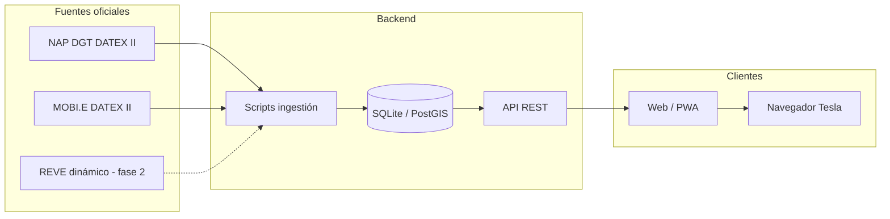

# Arquitectura propuesta

## Diagrama general



## Stack recomendado (MVP)

| Capa | Tecnología | Motivo |
|------|------------|--------|
| Ingestión | Python 3.11+ | XML DATEX II, ecosistema geo maduro |
| Parser DATEX | `lxml` + XSD o biblioteca DATEX | Feed oficial en XML |
| Almacenamiento | SQLite + SpatiaLite o PostGIS | MVP simple; PostGIS si crece |
| API | FastAPI | Filtros por bbox, potencia, país |
| Frontend | React/Vite o Svelte + **MapLibre GL** | Mapa vectorial, open source |
| Despliegue | Docker + nginx o static hosting | Bajo coste |

Alternativa minimalista: **solo static** — script genera GeoJSON, frontend filtra en cliente (válido hasta ~50k puntos con índices).

## API REST (borrador)

```
GET /api/v1/stations?min_kw=150&max_kw=500&country=ES,PT&bbox=west,south,east,north
GET /api/v1/stations/{id}
GET /api/v1/meta/stats          # conteos por potencia, operador, país
GET /api/v1/meta/operators
```

Respuesta paginada GeoJSON FeatureCollection o JSON con geometría.

## Filtro por potencia

Lógica de negocio:

- **Por conector:** el usuario ve puntos donde al menos un conector cumple `power_kw >= min_kw`.
- **Por sitio:** usar `max_power_kw` del emplazamiento (más simple para mapa).
- Presets UI: *Lento* (< 22 kW), *AC rápido* (22–43), *DC rápido* (43–100), *HPC* (≥ 100), *Ultrarrápido* (≥ 150).

## Cliente Tesla

El navegador del coche es Chromium embebido. Requisitos UX:

- Botones grandes, sin hover crítico
- Modo oscuro / alto contraste
- Evitar dependencias pesadas
- HTTPS obligatorio
- Probar geolocalización (puede requerir permisos en Tesla)

No hay API pública de Tesla para inyectar waypoints en el navegador del vehículo de forma fiable. Flujos alternativos:

- Mostrar coordenadas + botón “Copiar”
- Enlace `https://www.google.com/maps/dir/?api=1&destination=lat,lon`
- QR para continuar en el móvil

## Actualización de datos

| Fuente | Estrategia |
|--------|------------|
| NAP ES | Cron diario (coincide con feed) |
| NAP PT | Cron cada 6–12 h (feed grande) |
| REVE | Polling cada 5–15 min (fase 2) |

Guardar `fetched_at` y `source_version` en cada registro para depuración.

## Seguridad y legal

- Respetar licencias NAP (uso libre con atribución según DGT/MITECO).
- No scrapear REVE sin autorización si los términos lo prohíben.
- Rate limiting en API pública si se expone en internet.
- No almacenar datos personales de usuarios en MVP.

## Estructura de código prevista

```
src/
├── ingest/
│   ├── datex_parser.py      # tarea #6025
│   ├── fetch_spain.py       # tarea #6023
│   └── fetch_portugal.py    # tarea #6024
├── models/
│   └── station.py           # tarea #6026
├── api/
│   └── main.py              # tareas #6028–6030
└── web/
    ├── index.html
    ├── map/                 # tareas #6031–6032
    └── filters/             # tareas #6033–6035
```

Pipeline completo (#6027): `scripts/ingest_all.py` → `data/processed/stations.geojson`.

Implementación y estado: [`TASKBOARD.md`](../TASKBOARD.md) · [`STATUS.md`](STATUS.md).
