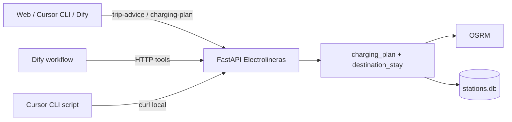

# Asistente de viaje — agente IA (Dify + Cursor CLI)

Última actualización: 2026-06-23

## Objetivo

Superar el enfoque del planificador Tesla («llegar al destino con SOC mínimo») recomendando **SOC de llegada** según la infraestructura **en la zona de destino**: potencia (11/22 kW vs 100+ kW), distancia al cargador más cercano y movilidad local prevista (pueblo en sierra, desvíos, etc.).

**Principio:** el motor determinista calcula números; la IA **interactúa** (chat + chips) sobre el plan ya visible en la app — no reexplica el itinerario en un monólogo. Ver #6166.

Persona y playbook: [`docs/agent/ev_expert_prompt.md`](agent/ev_expert_prompt.md), chat corto [`docs/agent/ev_chat_prompt.md`](agent/ev_chat_prompt.md), [`docs/agent/ev_travel_playbook.md`](agent/ev_travel_playbook.md) (#6155).

## Arquitectura



| Componente | Rol |
|------------|-----|
| `destination_stay` | Analiza cargadores cerca del destino (sin filtro min kW) y recomienda SOC de llegada |
| `GET /api/v1/stations/charging-plan` | Plan de ruta + `destination_stay` en modo route |
| `GET /api/v1/agent/trip-advice` | Plan + `agent_summary` y `agent_bullets` para agentes |
| `GET /api/v1/agent/trip-guide` | Contexto JSON + guía (local o Dify) para workflows |
| `GET /api/v1/private/trip-guide-from-car` | Igual desde telemetría TeslaMate (Asistente web) |
| `GET /api/v1/agent/score-charging-plan` | Alias reducido para Dify (#6056) |
| Dify (mini PC) | Workflow: llamar API → LLM redacta explicación |
| Cursor CLI | Script local que consulta la API y pide narrativa ampliada |

## Análisis de destino (`destination_stay`)

Parámetros:

- `destination_radius_km` (default 10): radio de búsqueda en destino
- `local_mobility_km` (default 40): km previstos en la zona (visitas, desvíos)

Bandas de potencia:

| Banda | Potencia | Implicación típica |
|-------|----------|-------------------|
| `ac_slow` | ≤22 kW | Varias horas para recuperar movilidad local |
| `ac_fast` | 22–43 kW | Horas de carga |
| `dc_fast` | 43–150 kW | ~45–90 min |
| `hpc` | ≥150 kW | ~30–45 min |

Respuesta incluye:

- `recommended_soc_at_arrival_pct` — objetivo de llegada
- `minimum_soc_at_arrival_pct` — reserva + energía para `local_mobility_km`
- `arrival_gap_pct` — diferencia si el plan actual llega por debajo
- Estrategia `arrive_with_buffer` cuando hace falta más SOC en ruta

## Configuración

Variables de entorno (`.env` o docker):

```env
CHARGING_AGENT_ENABLED=true
AGENT_API_TOKEN=          # opcional; si se define, header X-Agent-Token
DIFY_API_BASE_URL=        # opcional; ver docs/DIFY_TRIP_GUIDE.md
DIFY_TRIP_WORKFLOW_API_KEY=
```

Guía de viaje con IA: [DIFY_TRIP_GUIDE.md](./DIFY_TRIP_GUIDE.md).

## Uso — API

```bash
curl -s "http://127.0.0.1:8000/api/v1/agent/trip-advice?\
origin_lat=37.18&origin_lon=-3.60&dest_lat=40.35&dest_lon=-1.10&\
soc_percent=55&usable_capacity_kwh=57&consumption_wh_per_km=150&\
terrain_factor=1.25&local_mobility_km=50&destination_radius_km=15"
```

## Uso — Cursor CLI (mini PC)

```bash
./scripts/agent/trip_advice.sh \
  --origin "37.18,-3.60" --dest "40.35,-1.10" \
  --soc 55 --terrain 1.25 --local-km 50
```

El script llama a `trip-advice` y puede pasar el JSON a `cursor agent` para una explicación en lenguaje natural (sin recalcular SOC).

## Dify (#6057)

Workflow MVP recomendado:

1. Nodo HTTP → `score-charging-plan` con origen, destino, SOC, terreno
2. Nodo LLM con prompt fijo: «Explica al conductor las estrategias y el SOC recomendado en destino; no inventes estaciones ni porcentajes»
3. Salida: texto + JSON del plan original

Auth: red LAN o `AGENT_API_TOKEN` / `PRIVATE_API_TOKEN` en el nodo HTTP. Ver [`PHASE3_PRIVATE_STACK.md`](PHASE3_PRIVATE_STACK.md).

## Referencias

- [`EV_RANGE_PLAN.md`](EV_RANGE_PLAN.md) — Fase 3
- [`TASKBOARD.md`](../TASKBOARD.md) — #6056–#6058
