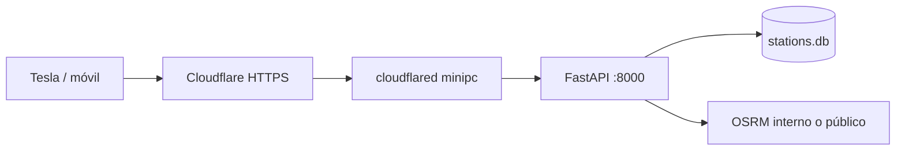

# Despliegue y pruebas

Guía para validar el MVP en desarrollo y exponerlo en producción vía **Cloudflare Tunnel** al minipc (`jualas.es`).

## Dominio recomendado

| Subdominio | Pros | Notas |
|------------|------|--------|
| **`electro.jualas.es`** | Claro, alineado con el proyecto | **Recomendado** |
| `cargadores.jualas.es` | Descriptivo en español | Más largo |
| `ev.jualas.es` | Corto | Menos obvio fuera del contexto |

Usar **un solo hostname** para web + API (FastAPI sirve el build estático y la API en el mismo origen). Evita problemas de CORS y simplifica el túnel.

---

## 1. Pruebas en desarrollo (ahora)

### Requisitos

- Python 3.11+ con `.venv` (`make install-dev`)
- Node 20+ para Vite
- Base de datos: `data/db/stations.db` (si falta: `make ingest` — PT tarda por el XML ~180 MB)

### Arranque típico (dos terminales)

```bash
# Terminal A — API
make api          # http://127.0.0.1:8000

# Terminal B — frontend con proxy
make web          # http://127.0.0.1:5173
```

Abre http://127.0.0.1:5173 — el proxy de Vite reenvía `/api` y `/health` al backend.

### Arranque “como producción” (un solo puerto)

Útil para validar antes del túnel:

```bash
make web-build
cp .env.example .env   # si no existe
# En .env:
#   SERVE_WEB_STATIC=true
#   API_HOST=127.0.0.1
#   API_PORT=8000
#   VITE_API_URL=       (vacío — mismo origen)
make api
```

Abre http://127.0.0.1:8000 — SPA + API en el mismo origen.

### Smoke test automático

```bash
make smoke
```

Comprueba `/health`, conteo de estaciones y un endpoint de listado.

### Checklist manual (Fase 1 MVP)

| # | Prueba | Cómo |
|---|--------|------|
| 1 | API viva | Badge «API ok» en cabecera |
| 2 | Mapa peninsular | Pestaña **Mapa** — puntos al mover/zoom |
| 3 | Filtros potencia | Chips / perfil En viaje / En ciudad |
| 4 | En ruta | Ejemplo Granada → Cartagena, ≥100 kW, lista + ruta en mapa |
| 5 | En ciudad | Dirección + radio 1 km, círculo en mapa |
| 6 | Navegación | **Navegar** abre Google Maps; **Copiar coords** |
| 7 | Tema oscuro | Toggle en cabecera (relevante para Tesla) |
| 8 | Móvil | Responsive; GPS en «Cerca de mí» / origen ruta |

**Dependencias externas en dev:** OSRM público (`router.project-osrm.org`) y Nominatim público. Si fallan, ruta/ciudad muestran error explícito.

### Desde el navegador del Tesla (pre-prod)

1. Desplegar con HTTPS (túnel Cloudflare, sección 2).
2. Abrir `https://electro.jualas.es` en el navegador del coche.
3. Verificar botones grandes, mapa y «Navegar».

---

## 2. Producción con Docker (mini PC)

Stack en **`/mnt/datos/docker/electrolineras/`** (patrón del resto de servicios en `mnt/datos/docker/`).

```bash
mkdir -p /mnt/datos/docker/volumes/electrolineras-data/db
cp /mnt/datos/Proyectos/Electrolineras/data/db/stations.db \
  /mnt/datos/docker/volumes/electrolineras-data/db/   # primera vez
cd /mnt/datos/docker/electrolineras
docker compose up -d --build
```

- **URL local:** http://127.0.0.1:8015 (API + SPA en un solo contenedor)
- **Datos:** `/mnt/datos/docker/volumes/electrolineras-data/`
- Detalle: [`docker/README.md`](../docker/README.md) en el repo

## 3. Producción con Cloudflare Tunnel (HTTPS)

No hace falta abrir puertos en el router ni certificados locales: **Cloudflare** termina TLS y `cloudflared` en el minipc conecta al servicio local.

### Arquitectura



### Paso A — DNS y túnel (dashboard Cloudflare)

1. En **Cloudflare Zero Trust** → **Networks** → **Tunnels** → crear túnel (ej. `electrolineras-minipc`).
2. Instalar `cloudflared` en el minipc (Debian):

   ```bash
   # Ver instrucciones actuales en:
   # https://developers.cloudflare.com/cloudflare-one/connections/connect-networks/downloads/
   ```

3. Public hostname en el túnel:
   - **Subdomain:** `electro` (o el elegido)
   - **Domain:** `jualas.es`
   - **Service:** `http://127.0.0.1:8015` (Docker en mini PC) o `:8000` si API sin Docker
4. Cloudflare crea el registro DNS (proxied) automáticamente.

### Paso B — Aplicación en el minipc

```bash
cd /ruta/Electrolineras
make install-dev
make web-build
cp .env.production.example .env
# Editar .env (ver abajo)
make api   # o systemd — ver Paso C
```

Variables críticas en `.env`:

```env
API_HOST=127.0.0.1
API_PORT=8000
API_RELOAD=false
SERVE_WEB_STATIC=true
API_CORS_ORIGINS=https://electro.jualas.es
VITE_API_URL=
NOMINATIM_USER_AGENT=Electrolineras/0.1.0 (https://electro.jualas.es; contact: tu-email)
```

`VITE_API_URL` vacío en build de producción: el frontend llama `/api/...` en el mismo dominio.

### Paso C — Servicio systemd (opcional)

```ini
# /etc/systemd/system/electrolineras.service
[Unit]
Description=Electrolineras API + web estática
After=network.target

[Service]
Type=simple
User=electrolineras
WorkingDirectory=/mnt/datos/Proyectos/Electrolineras
EnvironmentFile=/mnt/datos/Proyectos/Electrolineras/.env
ExecStart=/mnt/datos/Proyectos/Electrolineras/.venv/bin/electrolineras-api
Restart=on-failure

[Install]
WantedBy=multi-user.target
```

```bash
sudo systemctl enable --now electrolineras
```

El túnel Cloudflare debe apuntar a `http://127.0.0.1:8015` (despliegue Docker actual).

### Paso C alternativo — `config.yml` de cloudflared

Si gestionas el túnel por fichero:

```yaml
ingress:
  - hostname: electro.jualas.es
    service: http://127.0.0.1:8015
  - service: http_status:404
```

### Verificación post-despliegue

```bash
# Forzar IPv4 (importante si tu red no tiene salida IPv6)
curl -4 -s https://electro.jualas.es/health

curl -s https://electro.jualas.es/health
curl -s 'https://electro.jualas.es/api/v1/meta/stats' | head
```

### Paso D — `cloudflared` en Docker (recomendado en mini PC)

Igual que `kanban-cloudflared`: **`network_mode: host`**, no red `bridge`.

```bash
cd /mnt/datos/docker/electrolineras
# CLOUDFLARED_TOKEN en .env
docker compose up -d electrolineras-cloudflared
```

En Zero Trust, el **Service URL** debe ser `http://127.0.0.1:8015` (no `<IP-LAN-SERVIDOR>`).

---

## 3b. No carga `electro.jualas.es` (troubleshooting)

### 1. Nombre correcto

Usa **`electro.jualas.es`** (con **c**). El hostname `eletro.jualas.es` fue un error inicial y ya no debe existir.

### 2. IPv6 roto en la red local (causa frecuente)

Cloudflare publica registros **AAAA** (IPv6). Si tu router anuncia IPv6 pero **no tiene salida IPv6 real**, el navegador intenta IPv6 primero y falla.

En el mini PC suele verse:

```bash
curl -4 -s https://electro.jualas.es/health    # OK → {"status":"ok"}
curl -6 -s https://electro.jualas.es/health    # Error: red inaccesible
```

**Soluciones:**

| Opción | Acción |
|--------|--------|
| A | En el router: desactivar IPv6 WAN o arreglar conectividad IPv6 |
| B | Probar desde **4G** (móvil sin WiFi) — suele ir por IPv4 |
| C | En casa, usar LAN: **http://<IP-LAN-SERVIDOR>:8015** |
| D | En Linux, priorizar IPv4: archivo `/etc/gai.conf` → `precedence ::ffff:0:0/96 100` |

### 3. Túnel y origen

```bash
docker ps --filter electrolineras
curl -s http://127.0.0.1:8015/health
docker logs electrolineras-cloudflared --tail 30
```

- Contenedor `electrolineras` → **healthy**
- `electrolineras-cloudflared` → **Up**, `network_mode: host`
- Zero Trust → Public Hostname → `http://127.0.0.1:8015`

## 3c. Solo falla en WiFi de casa (desde fuera funciona)

Si **4G / exterior** abre `https://electro.jualas.es` pero **WiFi del router** no, casi siempre es:

1. **IPv6 roto en la LAN** — el móvil/PC intenta IPv6 hacia Cloudflare (registros AAAA) y tu router no tiene salida IPv6 real.
2. Desde fuera el cliente usa IPv4 y todo va bien.

### Comprobar en un portátil conectado al WiFi

```bash
curl -4 -s https://electro.jualas.es/health   # debería: {"status":"ok"}
curl -6 -s https://electro.jualas.es/health   # suele fallar en tu red
```

### Solución A — Arreglar en el router (recomendada)

En el router (o ONT):

- **Desactivar IPv6 en la WiFi/LAN**, o
- Activar IPv6 solo si el proveedor lo entrega bien (prueba en [test-ipv6.com](https://test-ipv6.com)).

Tras eso, `https://electro.jualas.es` debería funcionar igual que desde 4G.

### Solución B — Usar la IP local en casa

Sin pasar por Cloudflare:

**http://<IP-LAN-SERVIDOR>:8015**

Útil para el Tesla en el garaje con WiFi de casa. (HTTP; en HTTPS el navegador del coche puede pedir certificado — prueba primero.)

### Solución C — DNS local (Pi-hole / AdGuard / router)

Registro **solo en red interna**:

| Nombre | Tipo | Valor |
|--------|------|--------|
| `electro.jualas.es` | A | `<IP-LAN-SERVIDOR>` |

Sin registro AAAA local. Acceso: **http://electro.jualas.es:8015** (el servicio escucha en 8015, no en 443).

Para HTTPS local haría falta nginx + certificado propio (fase posterior).

### Solución D — Linux en el cliente

Archivo `/etc/gai.conf`:

```
precedence ::ffff:0:0/96  100
```

Prioriza IPv4 al resolver `electro.jualas.es` vía Cloudflare.

### Resumen

| Contexto | URL |
|----------|-----|
| Fuera de casa | `https://electro.jualas.es` |
| WiFi casa (rápido) | `http://<IP-LAN-SERVIDOR>:8015` |
| WiFi casa (tras arreglar IPv6) | `https://electro.jualas.es` |

El túnel Cloudflare y Docker **no requieren cambios** si desde fuera ya funciona.

Abrir la URL en móvil y en el Tesla.

---

## 5. Cron de ingestión (producción, #6040)

La API Docker **solo sirve datos**; las ingestiones corren en el **host** contra el volumen compartido.

### Configuración (mini PC)

```bash
cd /mnt/datos/Proyectos/Electrolineras
make install-dev              # .venv con CLIs de ingest
make cron-install             # copia scripts/cron/electrolineras.env.example → .env

# Editar umbrales / webhook si hace falta
nano scripts/cron/electrolineras.env

# Activar crontab (pegar contenido del example)
crontab -e
# → scripts/cron/electrolineras.crontab.example

# Logrotate (opcional — tarea #6052)
sudo cp scripts/cron/logrotate.electrolineras.example /etc/logrotate.d/electrolineras
```

### Jobs programados

| Job | Horario | Duración típ. | Fuente |
|-----|---------|---------------|--------|
| `es` | 06:15 diario | 1–3 min | NAP DGT |
| `pt` | cada 6 h | 5–15 min | MOBI.E |
| `reve` | cada 3 h | ~25 min | mapareve.es |

Todos escriben en `DATABASE_URL` del volumen Docker (`…/electrolineras-data/db/stations.db`).

### Verificación automática

Tras cada job, `scripts/cron/verify_ingest.py` comprueba:

- Último `ingest_run` con `status=ok` y timestamp reciente
- Conteos mínimos de estaciones (ES/PT/total)
- REVE: mínimo de estaciones ES con `dynamic_price`

Logs: `/mnt/datos/docker/volumes/electrolineras-data/logs/cron/ingest-{es,pt,reve}.log`

Alertas opcionales: `INGEST_WEBHOOK_URL` en `electrolineras.env` (POST JSON en fallo). Cierre operativo: tarea [#6052](../TASKBOARD.md#task-6052); monitoring integral: [#6045](../TASKBOARD.md#task-6045).

### Probar manualmente

```bash
make cron-test-es      # DATEX ES + verify
make cron-test-reve    # REVE + verify (largo)
bash scripts/cron/run_scheduled_job.sh pt
```

### Tras actualizar código del repo

```bash
cd /mnt/datos/Proyectos/Electrolineras
git pull
.venv/bin/pip install -e .
cd /mnt/datos/docker/electrolineras && docker compose up -d --build
```

El cron usa el `.venv` del repo (ingest/sync). Docker necesita rebuild solo si cambia API/frontend.

---

## 6. Orden sugerido tareas Fase Prod

Tras validar el MVP en dev y el primer acceso HTTPS:

| Orden | Tarea | Relación con HTTPS |
|-------|-------|-------------------|
| 1 | **#6047** Runbook (este doc) | Base operativa |
| 2 | **#6043** `.env.production.example` | Variables prod |
| 3 | **#6039** HTTPS + dominio | **Cloudflare Tunnel** (este enfoque) |
| 4 | **#6038** Docker Compose | Opcional; simplifica minipc |
| 5 | **#6037** OSRM self-hosted | Sustituir OSRM público |
| 6 | **#6040** Cron ingestión DATEX + REVE | **Ver sección 5** |
| 7 | **#6041–6047** | Backups, CI, monitoring… |

Con el túnel Cloudflare, **#6039** se reduce a: hostname + túnel + CORS + `NOMINATIM_USER_AGENT` correcto. No necesitas nginx/Let's Encrypt en el minipc.

---

## 4. Limitaciones conocidas (MVP)

- **OSRM público:** límites de uso; en prod planificar #6037.
- **Nominatim público:** rate limit; en prod #6046.
- **Sin Tesla Fleet API:** navegación vía Google/Apple Maps (#6036).
- **Datos:** cron host (#6040) — DATEX diario/6h + REVE cada 3h; ver [`DEPLOYMENT.md`](DEPLOYMENT.md#5-cron-de-ingestión-producción-6040).

---

## Referencias

- [Cloudflare Tunnel](https://developers.cloudflare.com/cloudflare-one/connections/connect-networks/)
- [Google Maps URLs](https://developers.google.com/maps/documentation/urls/get-started)
- [`NAVIGATION.md`](NAVIGATION.md) — envío al coche
- [`ARCHITECTURE.md`](ARCHITECTURE.md) — stack general
