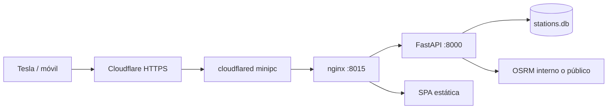
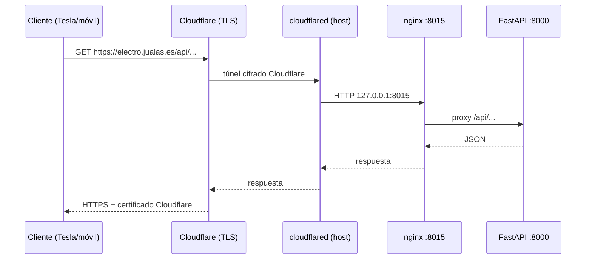

# Despliegue y pruebas

Guía para validar el MVP en desarrollo y exponerlo en producción vía **Cloudflare Tunnel** al minipc (`jualas.es`).

## Dominio recomendado

| Subdominio | Pros | Notas |
|------------|------|--------|
| **`electro.jualas.es`** | Claro, alineado con el proyecto | **Recomendado** |
| `cargadores.jualas.es` | Descriptivo en español | Más largo |
| `ev.jualas.es` | Corto | Menos obvio fuera del contexto |

Usar **un solo hostname** para web + API (FastAPI sirve el build estático y la API en el mismo origen). Evita problemas de CORS y simplifica el túnel.

---

## 1. Pruebas en desarrollo (ahora)

### Requisitos

- Python 3.11+ con `.venv` (`make install-dev`)
- Node 20+ para Vite
- Base de datos: `data/db/stations.db` (si falta: `make ingest` — PT tarda por el XML ~180 MB)

### Arranque típico (dos terminales)

```bash
# Terminal A — API
make api          # http://127.0.0.1:8000

# Terminal B — frontend con proxy
make web          # http://127.0.0.1:5173
```

Abre http://127.0.0.1:5173 — el proxy de Vite reenvía `/api` y `/health` al backend.

### Arranque “como producción” (un solo puerto)

Útil para validar antes del túnel:

```bash
make web-build
cp .env.example .env   # si no existe
# En .env:
#   SERVE_WEB_STATIC=true
#   API_HOST=127.0.0.1
#   API_PORT=8000
#   VITE_API_URL=       (vacío — mismo origen)
make api
```

Abre http://127.0.0.1:8000 — SPA + API en el mismo origen.

### Smoke test automático

```bash
make smoke
```

Comprueba `/health`, conteo de estaciones y un endpoint de listado.

### Checklist manual (Fase 1 MVP)

| # | Prueba | Cómo |
|---|--------|------|
| 1 | API viva | Badge «API ok» en cabecera |
| 2 | Mapa peninsular | Pestaña **Mapa** — puntos al mover/zoom |
| 3 | Filtros potencia | Chips / perfil En viaje / En ciudad |
| 4 | En ruta | Ejemplo Granada → Cartagena, ≥100 kW, lista + ruta en mapa |
| 5 | En ciudad | Dirección + radio 1 km, círculo en mapa |
| 6 | Navegación | **Navegar** abre Google Maps; **Copiar coords** |
| 7 | Tema oscuro | Toggle en cabecera (relevante para Tesla) |
| 8 | Móvil | Responsive; GPS en «Cerca de mí» / origen ruta |

**Dependencias externas en dev:** OSRM público (`router.project-osrm.org`) y Nominatim público. Si fallan, ruta/ciudad muestran error explícito.

### Desde el navegador del Tesla (pre-prod)

1. Desplegar con HTTPS (túnel Cloudflare, sección 2).
2. Abrir `https://electro.jualas.es` en el navegador del coche.
3. Verificar botones grandes, mapa y «Navegar».

---

## 2. Producción con Docker (mini PC)

Stack en **`/mnt/datos/docker/electrolineras/`** (patrón del resto de servicios en `mnt/datos/docker/`).

```bash
mkdir -p /mnt/datos/docker/volumes/electrolineras-data/{db,raw/es,raw/pt,processed,logs}
cp /mnt/datos/Proyectos/Electrolineras/data/db/stations.db \
  /mnt/datos/docker/volumes/electrolineras-data/db/   # primera vez
make docker-sync-prod
cd /mnt/datos/docker/electrolineras
cp env.example .env   # si no existe
docker compose -f docker-compose.prod.yml up -d --build
```

- **URL local:** http://127.0.0.1:8015 — **nginx** sirve la SPA y hace proxy de `/api/*` y `/health` hacia **FastAPI** (puerto interno 8000)
- **Datos:** `/mnt/datos/docker/volumes/electrolineras-data/` (db, raw, processed, logs)
- **OSRM:** red Docker `osrm_default` (`docker/osrm/docker-compose.yml`)
- Detalle: [`docker/README.md`](../docker/README.md)

Targets útiles: `make docker-build`, `make docker-up`, `make docker-down`, `make deploy`.

## 3. Producción con Cloudflare Tunnel (HTTPS)

No hace falta abrir puertos en el router ni certificados locales: **Cloudflare** termina TLS y `cloudflared` en el minipc conecta al servicio local.

### Arquitectura



### Paso A — DNS y túnel (dashboard Cloudflare)

1. En **Cloudflare Zero Trust** → **Networks** → **Tunnels** → crear túnel (ej. `electrolineras-minipc`).
2. Instalar `cloudflared` en el minipc (Debian):

   ```bash
   # Ver instrucciones actuales en:
   # https://developers.cloudflare.com/cloudflare-one/connections/connect-networks/downloads/
   ```

3. Public hostname en el túnel:
   - **Subdomain:** `electro` (o el elegido)
   - **Domain:** `jualas.es`
   - **Service:** `http://127.0.0.1:8015` (Docker en mini PC) o `:8000` si API sin Docker
4. Cloudflare crea el registro DNS (proxied) automáticamente.

### Paso B — Aplicación en el minipc

```bash
cd /ruta/Electrolineras
make install-dev
make web-build
cp .env.production.example .env
# Editar .env (ver abajo)
make api   # o systemd — ver Paso C
```

Variables críticas en `.env`:

```env
API_HOST=127.0.0.1
API_PORT=8000
API_RELOAD=false
SERVE_WEB_STATIC=true
API_CORS_ORIGINS=https://electro.jualas.es
VITE_API_URL=
NOMINATIM_USER_AGENT=Electrolineras/0.1.0 (https://electro.jualas.es; contact: tu-email)
```

`VITE_API_URL` vacío en build de producción: el frontend llama `/api/...` en el mismo dominio.

### Paso C — Servicio systemd (opcional)

```ini
# /etc/systemd/system/electrolineras.service
[Unit]
Description=Electrolineras API + web estática
After=network.target

[Service]
Type=simple
User=electrolineras
WorkingDirectory=/mnt/datos/Proyectos/Electrolineras
EnvironmentFile=/mnt/datos/Proyectos/Electrolineras/.env
ExecStart=/mnt/datos/Proyectos/Electrolineras/.venv/bin/electrolineras-api
Restart=on-failure

[Install]
WantedBy=multi-user.target
```

```bash
sudo systemctl enable --now electrolineras
```

El túnel Cloudflare debe apuntar a `http://127.0.0.1:8015` (despliegue Docker actual).

### Paso C alternativo — `config.yml` de cloudflared

Si gestionas el túnel por fichero:

```yaml
ingress:
  - hostname: electro.jualas.es
    service: http://127.0.0.1:8015
  - service: http_status:404
```

### Verificación post-despliegue

```bash
# Forzar IPv4 (importante si tu red no tiene salida IPv6)
curl -4 -s https://electro.jualas.es/health

curl -s https://electro.jualas.es/health
curl -s 'https://electro.jualas.es/api/v1/meta/stats' | head
```

### Paso D — `cloudflared` en Docker (recomendado en mini PC)

Igual que `kanban-cloudflared`: **`network_mode: host`**, no red `bridge`.

```bash
cd /mnt/datos/docker/electrolineras
# CLOUDFLARED_TOKEN en .env
docker compose up -d electrolineras-cloudflared
```

En Zero Trust, el **Service URL** debe ser `http://127.0.0.1:8015` (no `<IP-LAN-SERVIDOR>`).

Con el stack prod (#6038), el origen es **nginx** en `:8015` (HTTP); FastAPI queda solo en la red Docker interna.

```bash
cd /mnt/datos/docker/electrolineras
docker compose -f docker-compose.prod.yml up -d electrolineras-cloudflared
```

### TLS, dominio y decisión arquitectónica (#6039 / #6084)

**Estado:** cerrado. HTTPS y dominio público operativos vía **Cloudflare Tunnel** — no se despliega Let's Encrypt, Caddy TLS ni certificados locales en el mini PC.

| Aspecto | Implementación actual | Notas |
|---------|----------------------|-------|
| **Dominio público** | `https://electro.jualas.es` | Un solo hostname para SPA + API (mismo origen) |
| **DNS** | Cloudflare (registro proxied ☁️) | Creado al configurar Public Hostname del túnel |
| **Certificados TLS** | Cloudflare (edge) | Emisión y renovación automáticas; sin `certbot` en el host |
| **Terminación TLS** | Cloudflare → cliente | Tráfico usuario↔Cloudflare siempre HTTPS |
| **Origen (túnel → app)** | `http://127.0.0.1:8015` | HTTP en localhost; aceptable porque no sale de la máquina |
| **Reverse proxy app** | nginx (`electrolineras-nginx`) | Sirve estáticos Vite; proxy `/api/*` y `/health` → FastAPI |
| **Forzar HTTPS** | Dashboard Cloudflare → SSL/TLS → **Always Use HTTPS** | Redirección HTTP→HTTPS en el edge |
| **HSTS** | FastAPI `SecurityHeadersMiddleware` con `API_TRUST_PROXY_HEADERS=true` | Solo cuando la petición llega vía Cloudflare (header `CF-Connecting-IP`) |
| **Headers básicos** | nginx + middleware API (#6042) | `X-Content-Type-Options`, `X-Frame-Options`, etc. |
| **www** | No configurado | Solo `electro.jualas.es`; añadir CNAME `www` solo si se necesita alias |
| **Puertos router** | Cerrados | El túnel es saliente; no hace falta NAT 443→minipc |

#### Flujo de una petición



#### Qué **no** implementar (duplicaría infraestructura)

- Certificados Let's Encrypt en nginx del mini PC
- Caddy con TLS local en `:443`
- Abrir puerto 443 en el router hacia el minipc

El nginx del stack prod escucha **HTTP** en `:8015`; la capa TLS la aporta Cloudflare.

#### Checklist operativo (#6039 cerrado)

| # | Comprobación | Comando / ubicación |
|---|--------------|---------------------|
| 1 | Health HTTPS público | `curl -4 -s https://electro.jualas.es/health` |
| 2 | API vía dominio | `curl -s 'https://electro.jualas.es/api/v1/meta/stats'` |
| 3 | CORS acota al dominio | `API_CORS_ORIGINS` incluye `https://electro.jualas.es` |
| 4 | Túnel activo | `docker logs electrolineras-cloudflared --tail 20` |
| 5 | Origen local OK | `curl -s http://127.0.0.1:8015/health` |
| 6 | Always Use HTTPS | Cloudflare dashboard → SSL/TLS |
| 7 | User-Agent geocoding | `NOMINATIM_USER_AGENT` con URL de contacto real |

#### Renovación de certificados

No hay acción en el mini PC. Cloudflare renueva los certificados del edge de forma automática. Si cambias de dominio o añades un hostname nuevo, configúralo en **Zero Trust → Tunnels → Public Hostname** (Cloudflare crea/actualiza DNS).

#### Alternativa futura (no recomendada hoy)

Si algún día se deja Cloudflare Tunnel: haría falta TLS en el origen (Caddy/Let's Encrypt) **y** abrir puertos en el router. Documentar entonces un runbook aparte; no mezclar con el setup actual.

---

## 3b. No carga `electro.jualas.es` (troubleshooting)

### 1. Nombre correcto

Usa **`electro.jualas.es`** (con **c**). El hostname `eletro.jualas.es` fue un error inicial y ya no debe existir.

### 2. IPv6 roto en la red local (causa frecuente)

Cloudflare publica registros **AAAA** (IPv6). Si tu router anuncia IPv6 pero **no tiene salida IPv6 real**, el navegador intenta IPv6 primero y falla.

En el mini PC suele verse:

```bash
curl -4 -s https://electro.jualas.es/health    # OK → {"status":"ok"}
curl -6 -s https://electro.jualas.es/health    # Error: red inaccesible
```

**Soluciones:**

| Opción | Acción |
|--------|--------|
| A | En el router: desactivar IPv6 WAN o arreglar conectividad IPv6 |
| B | Probar desde **4G** (móvil sin WiFi) — suele ir por IPv4 |
| C | En casa, usar LAN: **http://<IP-LAN-SERVIDOR>:8015** |
| D | En Linux, priorizar IPv4: archivo `/etc/gai.conf` → `precedence ::ffff:0:0/96 100` |

### 3. Túnel y origen

```bash
docker ps --filter name=electrolineras
curl -s http://127.0.0.1:8015/health
docker logs electrolineras-cloudflared --tail 30
```

- Contenedores `electrolineras-api` y `electrolineras-nginx` → **healthy** (stack prod #6038)
- `electrolineras-cloudflared` → **Up**, `network_mode: host`
- Zero Trust → Public Hostname → `http://127.0.0.1:8015`

## 3c. Solo falla en WiFi de casa (desde fuera funciona)

Si **4G / exterior** abre `https://electro.jualas.es` pero **WiFi del router** no, casi siempre es:

1. **IPv6 roto en la LAN** — el móvil/PC intenta IPv6 hacia Cloudflare (registros AAAA) y tu router no tiene salida IPv6 real.
2. Desde fuera el cliente usa IPv4 y todo va bien.

### Comprobar en un portátil conectado al WiFi

```bash
curl -4 -s https://electro.jualas.es/health   # debería: {"status":"ok"}
curl -6 -s https://electro.jualas.es/health   # suele fallar en tu red
```

### Solución A — Arreglar en el router (recomendada)

En el router (o ONT):

- **Desactivar IPv6 en la WiFi/LAN**, o
- Activar IPv6 solo si el proveedor lo entrega bien (prueba en [test-ipv6.com](https://test-ipv6.com)).

Tras eso, `https://electro.jualas.es` debería funcionar igual que desde 4G.

### Solución B — Usar la IP local en casa

Sin pasar por Cloudflare:

**http://<IP-LAN-SERVIDOR>:8015**

Útil para el Tesla en el garaje con WiFi de casa. (HTTP; en HTTPS el navegador del coche puede pedir certificado — prueba primero.)

### Solución C — DNS local (Pi-hole / AdGuard / router)

Registro **solo en red interna**:

| Nombre | Tipo | Valor |
|--------|------|--------|
| `electro.jualas.es` | A | `<IP-LAN-SERVIDOR>` |

Sin registro AAAA local. Acceso: **http://electro.jualas.es:8015** (el servicio escucha en 8015, no en 443).

Para HTTPS local haría falta nginx + certificado propio (fase posterior).

### Solución D — Linux en el cliente

Archivo `/etc/gai.conf`:

```
precedence ::ffff:0:0/96  100
```

Prioriza IPv4 al resolver `electro.jualas.es` vía Cloudflare.

### Resumen

| Contexto | URL |
|----------|-----|
| Fuera de casa | `https://electro.jualas.es` |
| WiFi casa (rápido) | `http://<IP-LAN-SERVIDOR>:8015` |
| WiFi casa (tras arreglar IPv6) | `https://electro.jualas.es` |

El túnel Cloudflare y Docker **no requieren cambios** si desde fuera ya funciona.

Abrir la URL en móvil y en el Tesla.

---

## 5. Cron de ingestión (producción, #6040)

La API Docker **solo sirve datos**; las ingestiones corren en el **host** contra el volumen compartido.

### Configuración (mini PC)

```bash
cd /mnt/datos/Proyectos/Electrolineras
make install-dev              # .venv con CLIs de ingest
make cron-install             # copia scripts/cron/electrolineras.env.example → .env

# Editar umbrales / webhook si hace falta
nano scripts/cron/electrolineras.env

# Activar crontab (pegar contenido del example)
crontab -e
# → scripts/cron/electrolineras.crontab.example

# Logrotate (opcional — tarea #6052)
sudo cp scripts/cron/logrotate.electrolineras.example /etc/logrotate.d/electrolineras
# Ajustar `su usuario grupo` en el fichero si el dueño de los logs no es jualas.
sudo logrotate -d /etc/logrotate.d/electrolineras   # dry-run
```

### Jobs programados

| Job | Horario | Duración típ. | Fuente |
|-----|---------|---------------|--------|
| `es` | 06:15 diario | 1–3 min | NAP DGT |
| `pt` | cada 6 h | 5–15 min | MOBI.E |
| `reve` | cada 3 h | ~25 min | mapareve.es |

Todos escriben en `DATABASE_URL` del volumen Docker (`…/electrolineras-data/db/stations.db`).

### Verificación automática

Tras cada job, `scripts/cron/verify_ingest.py` comprueba:

- Último `ingest_run` con `status=ok` y timestamp reciente
- Conteos mínimos de estaciones (ES/PT/total)
- REVE: mínimo de estaciones ES con `dynamic_price`

Logs: `/mnt/datos/docker/volumes/electrolineras-data/logs/cron/ingest-{es,pt,reve}.log`

Alertas opcionales: `INGEST_WEBHOOK_URL` en `electrolineras.env` (POST en fallo). Formatos soportados: **ntfy** (`https://ntfy.sh/topic-secreto`), Slack, Discord, n8n. Cierre operativo: [#6052](../TASKBOARD.md#task-6052); monitoring integral: [#6045](../TASKBOARD.md#task-6045).

**ntfy (recomendado):** instala [ntfy](https://ntfy.sh) en el móvil → *Subscribe to topic* → mismo nombre que en la URL (p. ej. `electrolineras-ingest-b4e8f21a`).

```bash
# Webhook (#6052)
bash scripts/cron/test_ingest_webhook.sh
bash scripts/cron/test_ingest_failure_notify.sh   # mismo camino que run_scheduled_job.sh en fallo
```

### Probar manualmente

```bash
make cron-test-es      # DATEX ES + verify
make cron-test-reve    # REVE + verify (largo)
bash scripts/cron/run_scheduled_job.sh pt
```

### Tras actualizar código del repo

```bash
cd /mnt/datos/Proyectos/Electrolineras
git pull
.venv/bin/pip install -e .
cd /mnt/datos/docker/electrolineras && docker compose up -d --build
```

El cron usa el `.venv` del repo (ingest/sync). Docker necesita rebuild solo si cambia API/frontend.

---

## 6. Backups SQLite y data/ (#6041)

Destino por defecto: `/mnt/datos/docker/backups/electrolineras/`

| Tipo | Cuándo | Contenido | Retención |
|------|--------|-----------|-----------|
| **daily** | Cron 05:30 | `stations.db` (backup online), `stations.geojson`, último XML es/pt + manifests | 7 días (+ domingos 30 días) |
| **pre-pt** | Antes de cada ingest PT | Solo `stations.db` | 7 días |

Variables en `scripts/cron/electrolineras.env`: `BACKUP_ROOT`, `BACKUP_RAW_DIR`, `BACKUP_*_RETENTION_DAYS`.

### Activar cron de backup

Añadir a `crontab -e` (incluido en `electrolineras.crontab.example`):

```cron
30 5 * * * /mnt/datos/Proyectos/Electrolineras/scripts/backup/run_backup.sh daily
```

### Comandos

```bash
make backup-run          # backup manual daily
make backup-verify       # restauración de prueba en /tmp + conteo estaciones
bash scripts/backup/run_backup.sh pre-pt

# Restaurar producción (detener API antes)
cd /mnt/datos/docker/electrolineras && docker compose stop electrolineras
bash scripts/backup/restore_backup.sh --date 2026-07-04
docker compose up -d electrolineras
```

Logs: `{ELECTROLINERAS_DATA}/logs/backup/backup-daily-YYYYMMDD.log`

---

## 7. Monitoring y alertas (#6045)

Script: `scripts/monitoring/run_health_checks.sh` (cron **cada 15 min**).

| Check | Qué comprueba |
|-------|----------------|
| API | `GET /health` (default `http://127.0.0.1:8015/health`) |
| OSRM car / shortest | Ruta smoke Madrid (~200 m) en `:5000` y `:5001` |
| SQLite | `PRAGMA integrity_check` + conteos mínimos |
| Ingest | Frescura `ingest_run` es / pt / reve (mismas reglas que `verify_ingest.py`) |
| Disco | Uso % en volumen data y carpeta backups (umbral `MONITOR_DISK_WARN_PCT`, default 85) |

Alertas vía **`INGEST_WEBHOOK_URL`** (ntfy/Slack/Discord) con **cooldown** `MONITOR_ALERT_COOLDOWN_MINUTES` (default 180) para no spamear.

```bash
make monitor-test          # sin alertas
make monitor-check         # con alertas + log
```

Logs: `{ELECTROLINERAS_DATA}/logs/monitor/health-YYYYMMDD.log`  
Estado cooldown: `{ELECTROLINERAS_DATA}/logs/monitor/state.json`

Cron (incluido en `electrolineras.crontab.example`):

```cron
*/15 * * * * /mnt/datos/Proyectos/Electrolineras/scripts/monitoring/run_health_checks.sh
```

---

## 8. Hardening API (#6042)

Middleware en `src/api/security/` (rate limit, cabeceras, tamaño de body, docs).

| Variable | Prod recomendado | Efecto |
|----------|------------------|--------|
| `API_ENVIRONMENT` | `production` | CORS más estricto; `/docs` desactivado por defecto |
| `API_CORS_ORIGINS` | `https://electro.jualas.es` (+ LAN si hace falta) | Solo orígenes permitidos |
| `API_TRUST_PROXY_HEADERS` | `true` (Cloudflare Tunnel) | IP real (`CF-Connecting-IP`) + HSTS |
| `API_RATE_LIMIT_ENABLED` | `true` | Límite por IP y tipo de endpoint |
| `API_RATE_LIMIT_ROUTING_PER_MINUTE` | `30` | OSRM: along-route, charging-plan, agent/private |
| `API_RATE_LIMIT_GEOCODE_PER_MINUTE` | `45` | Nominatim: nearby, geocode |
| `API_RATE_LIMIT_AUTH_PER_MINUTE` | `15` | Login TOTP |
| `API_MAX_REQUEST_BODY_BYTES` | `65536` | Rechaza POST > 64 KiB |
| `API_DOCS_ENABLED` | `false` | Sin Swagger/OpenAPI público |
| `OSRM_TIMEOUT_SECONDS` | `30` | Timeout httpx hacia OSRM (ya existente) |

Respuesta **429** incluye `Retry-After` y cabeceras `X-RateLimit-*`. `/health` queda exento (monitoring).

Si necesitas `/docs` en prod: `API_DOCS_ENABLED=true` + `API_DOCS_BASIC_AUTH_USER/PASSWORD`.

Tras cambiar variables en `/mnt/datos/docker/electrolineras/.env`:

```bash
cd /mnt/datos/docker/electrolineras
docker compose up -d --build electrolineras
```

---

## 9. Variables de entorno y secretos (#6043)

Guía completa: [`docs/ENV.md`](ENV.md).

| Plantilla | Destino real |
|-----------|--------------|
| `.env.production.example` | Referencia prod / systemd |
| `docker/env.example` | `/mnt/datos/docker/electrolineras/.env` |
| `scripts/cron/electrolineras.env.example` | Cron host |

```bash
cp docker/env.example /mnt/datos/docker/electrolineras/.env
nano /mnt/datos/docker/electrolineras/.env
make env-check-prod ENV_FILE=/mnt/datos/docker/electrolineras/.env
make env-secure
```

Obligatorias en prod: `DATABASE_URL`, `API_CORS_ORIGINS`, `OSRM_BASE_URL`, `NOMINATIM_USER_AGENT`, `API_ENVIRONMENT=production`, `API_RELOAD=false`. Build frontend con `VITE_API_URL` vacío.

Secretos: permisos `600`, no commitear; generar auth con `python scripts/auth/setup_private_auth.py`.

CI/CD (#6044): [`docs/CI_CD.md`](CI_CD.md) — GitHub Actions (lint/test/build) + deploy con runner self-hosted o `make deploy`.

---

## 11. Nominatim self-hosted (#6046)

Guía completa: [`docs/NOMINATIM.md`](NOMINATIM.md).

```bash
make nominatim-prepare    # PBF Iberia (reutiliza OSRM)
make nominatim-up         # importación inicial (horas)
```

API prod:

```env
NOMINATIM_BASE_URL=http://host.docker.internal:8092
NOMINATIM_FALLBACK_BASE_URL=
NOMINATIM_CACHE_ENABLED=true
```

Tras arrancar Nominatim, activar monitoring opcional en `electrolineras.env`:

```env
MONITOR_NOMINATIM_URL=http://127.0.0.1:8092/search?q=Madrid&format=json&limit=1&countrycodes=es
```

---

## 10. Orden sugerido tareas Fase Prod

Tras validar el MVP en dev y el primer acceso HTTPS:

| Orden | Tarea | Relación con HTTPS |
|-------|-------|-------------------|
| 1 | **#6047** Runbook (este doc) | Base operativa |
| 2 | **#6043** `.env.production.example` | **Ver [`ENV.md`](ENV.md)** |
| 3 | **#6039** HTTPS + dominio | ✅ **Cloudflare Tunnel** — sección 3 y «TLS, dominio…» |
| 4 | **#6038** Docker Compose | ✅ nginx + API (origen `:8015`) |
| 5 | **#6037** OSRM self-hosted | Sustituir OSRM público |
| 6 | **#6040** Cron ingestión DATEX + REVE | **Ver sección 5** |
| 6a | **#6041** Backups SQLite + data/ | **Ver sección 6** |
| 6b | **#6045** Monitoring y alertas | **Ver sección 7** |
| 6c | **#6042** Rate limiting + hardening API | **Ver sección 8** |
| 6d | **#6043** Variables de entorno y secretos | **Ver sección 9** |
| 6e | **#6044** CI/CD despliegue automatizado | [`CI_CD.md`](CI_CD.md) |
| 7 | **#6046** | Nominatim self-hosted — [`NOMINATIM.md`](NOMINATIM.md) |

**#6039** no requiere Let's Encrypt local: hostname `electro.jualas.es`, túnel `cloudflared`, CORS acotado y `NOMINATIM_USER_AGENT` con URL de contacto. Ver checklist en la sección «TLS, dominio y decisión arquitectónica».

---

## 4. Limitaciones conocidas (MVP)

- **OSRM público:** límites de uso; en prod planificar #6037.
- **Nominatim público:** rate limit; en prod usar self-hosted — [`NOMINATIM.md`](NOMINATIM.md) (#6046).
- **Sin Tesla Fleet API:** navegación vía Google/Apple Maps (#6036).
- **Datos:** cron host (#6040) — DATEX diario/6h + REVE cada 3h; ver [`DEPLOYMENT.md`](DEPLOYMENT.md#5-cron-de-ingestión-producción-6040).

---

## Referencias

- [Cloudflare Tunnel](https://developers.cloudflare.com/cloudflare-one/connections/connect-networks/)
- [Google Maps URLs](https://developers.google.com/maps/documentation/urls/get-started)
- [`NAVIGATION.md`](NAVIGATION.md) — envío al coche
- [`ARCHITECTURE.md`](ARCHITECTURE.md) — stack general
